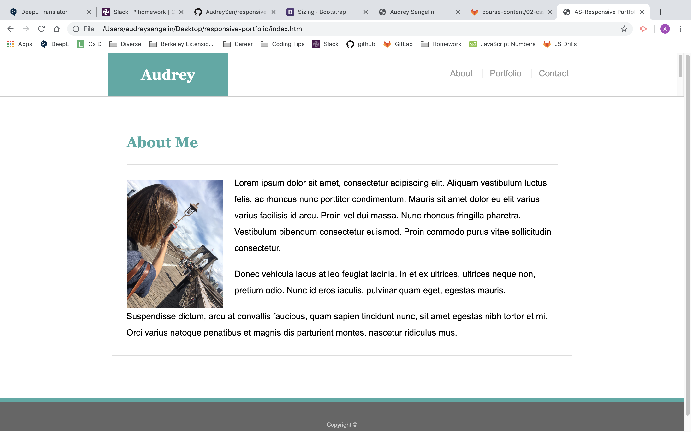

# Responsive-Portfolio
## Image

## Summary
On a web page, I create a responsive portfolio so that each file adapt themselves to the size of the screen device.

## Steps
I added different elements on three HTML pages.

Then I created a second CSS sheet where I added three different media query rules, so that the three html pages adapt themselves when a user browse them on a smaller screen.

I also add a picture on the index.html file.

Each time I made changes to the local repository, I pushed them to GitHub.

I went to my GitHub repositories. I scroll down to find the right repository.

I deployed my site by using GitHub pages to create a live site.

## Technologies used
HTML
CSS
A CSS technique called Media Queries
Git
GitHub
Author Links
GitHub

